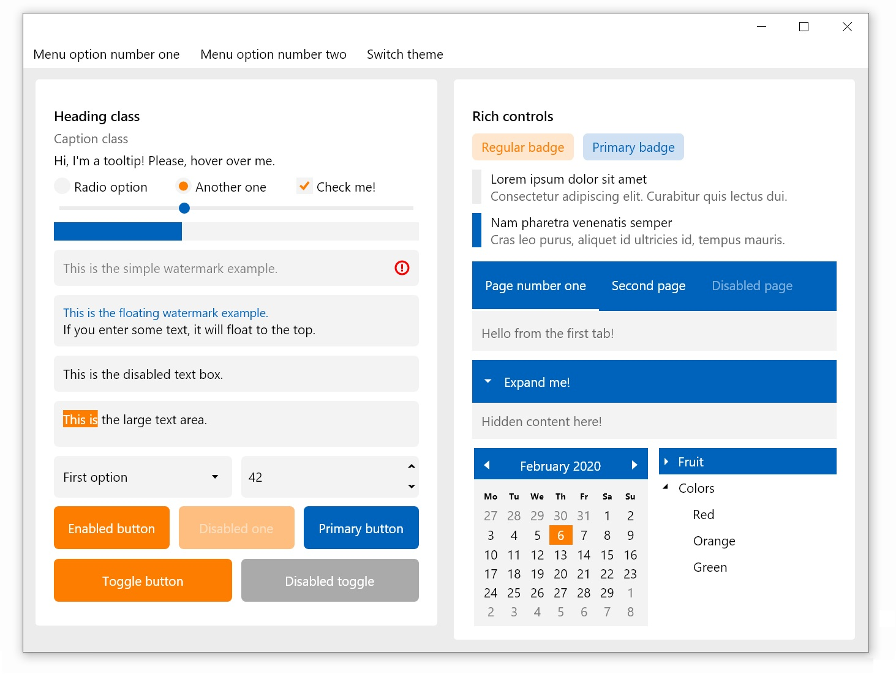
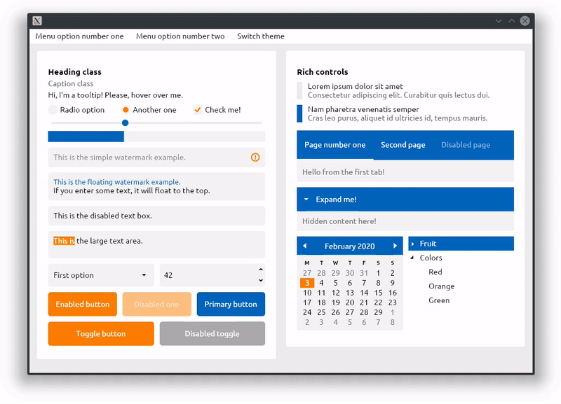

[](https://worldbeater.visualstudio.com/Citrus.Avalonia/_build/latest?definitionId=1)  [](https://www.nuget.org/packages/Citrus.Avalonia)  

### Citrus

Avalonia experimental theme.



### Getting Started

The easiest way to get started is to install the library as a NuGet package:

```powershell
Install-Package Citrus.Avalonia
# Or 'dotnet add package Citrus.Avalonia'
```

Then, reference the preffered theme from your `App.xaml` file:

```xml
<Application xmlns="https://github.com/avaloniaui"
             xmlns:x="http://schemas.microsoft.com/winfx/2006/xaml"
             x:Class="YourNamespace.App">
  <Application.Styles>
    <!-- The line below is the only thing you need to get started.
         Tested with Avalonia 0.9.0 only, although not with all controls. -->
    <StyleInclude Source="avares://Citrus.Avalonia/Citrus.xaml"/>

    <!-- To use other themes:
         1. Comment out *all* of the <StyleInclude /> lines.
         2. Uncomment *one* of the <StyleInclude /> lines below. -->
    <!-- <StyleInclude Source="avares://Citrus.Avalonia/Sea.xaml"/> -->
    <!-- <StyleInclude Source="avares://Citrus.Avalonia/Rust.xaml"/> -->
    <!-- <StyleInclude Source="avares://Citrus.Avalonia/Candy.xaml"/> -->
    <!-- <StyleInclude Source="avares://Citrus.Avalonia/Magma.xaml"/> -->
  </Application.Styles>
</Application>
```

Done! Now the templates of all default controls are updated. See the [sandbox project](https://github.com/worldbeater/Citrus.Avalonia/blob/master/src/Citrus.Avalonia.Sandbox/MainWindow.xaml) for more examples. See [`StyleManager.cs`](https://github.com/worldbeater/Citrus.Avalonia/blob/master/src/Citrus.Avalonia.Sandbox/StyleManager.cs) to learn how to change color scheme at runtime.



### Getting Started without NuGet

Another way to get started is to add this repo as a [submodule](https://git-scm.com/book/en/v2/Git-Tools-Submodules) to your existing git repository:

```sh
mkdir ./external
git submodule add git@github.com:worldbeater/Citrus.Avalonia.git ./external/citrus
# Reference the ../external/citrus/src/Citrus.Avalonia/Citrus.Avalonia.csproj project then.
# The ../external/citrus/src/Citrus.Avalonia.Sandbox/Citrus.Avalonia.Sandbox.csproj is 
# the sandbox where you can browse the markup samples.
```

### Technologies and Tools Used

- <a href="https://github.com/avaloniaui">AvaloniaUI</a> cross-platform XAML-based GUI framework
- <a href="https://reactiveui.net/docs/handbook/view-models/boilerplate-code">ReactiveUI.Fody</a> for MVVM implementation in the sandbox project
- <a href="https://github.com/reactiveui/reactiveui.validation">ReactiveUI.Validation</a> for `INotifyDataErrorInfo` validations
- <a href="https://www.jetbrains.com/rider/">JetBrains Rider</a> cross-platform C# IDE
